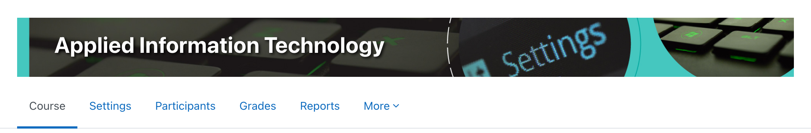
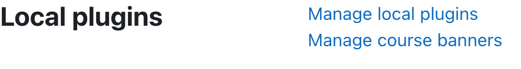
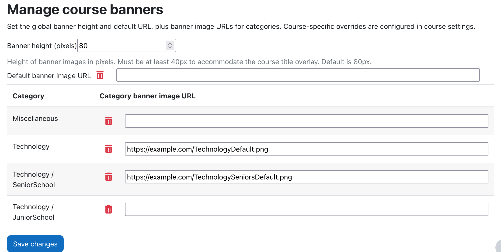
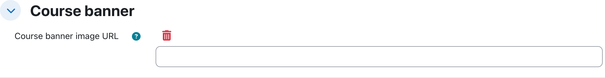

# Course banner plugin (local_coursebanner)

A Moodle local plugin that displays customizable banner images on course pages.



## Compatibility

**Supported Moodle versions:** 4.5 (LTS), 5.0, 5.1

- Moodle 4.5.x (LTS) - Full support
- Moodle 5.0.x - Full support  
- Moodle 5.1.x - Full support (see installation notes below)

**Requirements:**
- PHP 8.1+ (Moodle 4.5) or PHP 8.2+ (Moodle 5.0+)
- PostgreSQL 13+, MySQL 8.0+, or MariaDB 10.6.7+ (Moodle 4.5)
- PostgreSQL 14+, MySQL 8.4+, or MariaDB 10.11.0+ (Moodle 5.0)
- PostgreSQL 15+ (Moodle 5.1)

## Installation

### Moodle 4.5 and 5.0
Install by placing this folder in `<moodle>/local/coursebanner` and visiting the Site administration notifications page.

### Moodle 5.1
Due to the directory restructure in Moodle 5.1, install by placing this folder in `<moodle>/public/local/coursebanner` and visiting the Site administration notifications page.

**Note:** If upgrading an existing installation from 4.5/5.0 to 5.1, you will need to move the plugin folder from `<moodle>/local/coursebanner` to `<moodle>/public/local/coursebanner` after the Moodle upgrade. See the UPGRADE.md file for detailed instructions.

## Configuration



1. Set the global banner height, optional default banner URL, and category/subcategory banner URLs in **Site administration → Plugins → Local plugins → Manage course banners**.
2. Optionally override per course in **Course settings → Course banner image URL**.





### Resolution order

1. Course override (if set)
2. Closest category banner (walks up to parent categories)
3. Default banner URL
## Banner Image Specifications

The banner image is displayed at a centrally configurable height (default 80px) with full page width, using CSS `object-fit: cover`.

### Recommended Dimensions

- **Width:** 1600–2000px (minimum 1600px for sharpness)
- **Height:** 300–316px (maintains good aspect ratio)
- **Aspect Ratio:** Approximately 6:1

Example: 2000×316px

### Content Placement Guidelines

- Keep all important visual content in the **middle vertical band** of the image
- Avoid critical content within 50–60px of the top or bottom edges—these will be cropped
- Decorative elements can extend to the full image boundaries

## Build and package

From the repository root, run:

```bash
./build_plugin.sh
```

This will:

1. Minify AMD JavaScript from `amd/src/*.js` into `amd/build/*.min.js`
2. Create `local_coursebanner.zip` ready for installation
